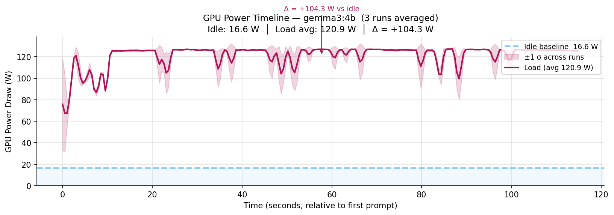
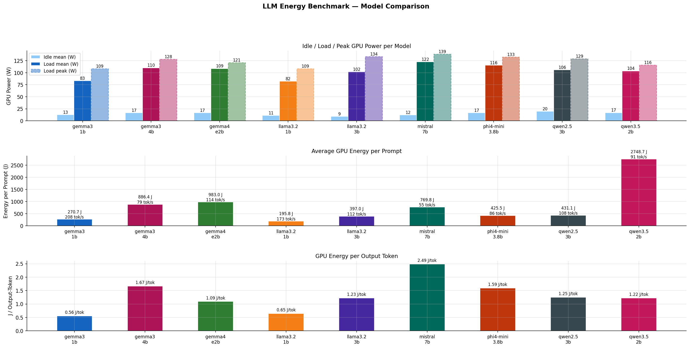
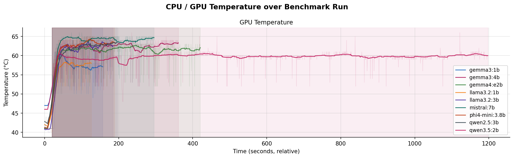

# LLM Energy Benchmark (WSL2 + NVIDIA Edition)

Automated test framework for measuring the energy consumption of Docker-hosted
language models – optimized for **WSL2 with NVIDIA GPU**.

Measurement via **`nvidia-smi`** (GPU power draw in watts, every 500 ms),
no RAPL, no eBPF, no root privileges required.

---

## Prerequisites

| What | Where |
|---|---|
| Windows 11 + WSL2 | NVIDIA driver ≥ 530 on the Windows host |
| Python 3.10+ in WSL2 | `python3 --version` |
| Docker (Desktop or native) | `docker info` |
| nvidia-container-toolkit | for GPU passthrough in Docker |
| `nvidia-smi` in WSL2 | should be available automatically |

### Install nvidia-container-toolkit (one-time)
```bash
curl -fsSL https://nvidia.github.io/libnvidia-container/gpgkey \
  | sudo gpg --dearmor -o /usr/share/keyrings/nvidia-container-toolkit-keyring.gpg

curl -s -L https://nvidia.github.io/libnvidia-container/stable/deb/nvidia-container-toolkit.list \
  | sudo tee /etc/apt/sources.list.d/nvidia-container-toolkit.list

sudo apt-get update && sudo apt-get install -y nvidia-container-toolkit
sudo nvidia-ctk runtime configure --runtime=docker
sudo service docker restart
```

---

## Quick Start

```bash
# 1. One-time setup
bash setup.sh

# 2. Start benchmark
source .venv/bin/activate
python3 benchmark.py --models gemma3:4b llama3.2:3b phi4-mini:3.8b --runs 3

# 3. Generate plots (for current dataset)
python3 plot_results.py {timestamp}
```

---

## Parameters

### Benchmarking
```bash
python3 benchmark.py
  --models  gemma3:4b llama3.2:3b   # any number of Ollama tags
  --runs    3                        # repetitions per model
  --idle-secs   20                   # seconds of idle measurement before each model
  --warmup-secs 10                   # extra sleep after model load
  --prompts-file prompts.txt         # custom prompts
  --no-docker                        # Ollama already running (no Docker management)
  --no-gpu                           # CPU-only Docker (no --gpus all)
  --out-dir results                  # output directory
```

### Plots
```bash

# Select a specific benchmark run via timestamp
python3 plot_results.py 20250522_143012

```
The timestamp corresponds to the suffix of the files in `results/` – `prompts_YYYYMMDD_HHMMSS.csv` and `timeseries_YYYYMMDD_HHMMSS.csv` are resolved automatically from it.

---

## Output

```
results/
  prompts_YYYYMMDD_HHMMSS.csv       ← one entry per prompt execution
  timeseries_YYYYMMDD_HHMMSS.csv    ← raw nvidia-smi samples (500ms interval)
  system_info_YYYYMMDD_HHMMSS.json  ← hardware documentation of the run

plots/
  timeline_gemma3_4b.png          ← averaged power curve: idle vs. load
  timeline_llama3.2_3b.png
  comparison_bar.png              ← bar chart model comparison
  temperatures.png                ← CPU and GPU temperature curve
  summary_table.csv               ← numerical summary
```

### `prompts_*.csv` columns

| Column | Description |
|---|---|
| `run_id` | repetition number, or `0` for idle |
| `phase` | `idle` or `load` |
| `duration_ms` | response time |
| `tokens_per_sec` | generation speed |
| `gpu_mean_w` | average GPU power during this prompt |
| `gpu_peak_w` | peak GPU power |
| `gpu_energy_j` | energy = mean_w × duration (joules) |

---

## Understanding the Plots

### `timeline_<model>.png`
- **Dashed line**: idle baseline (GPU power without inference)
- **Colored curve**: averaged load power across all runs
- **Shaded area**: ±1σ between runs
- **Δ annotation**: extra consumption compared to idle


### `comparison_bar.png`
- **Top**: idle (light blue) / mean load / peak load per model in watts
- **Bottom**: energy per prompt in joules + tokens/s


### `temperatures.png`
- **Top**: GPU temperature over the entire run duration per model
- **Bottom**: CPU temperature (if available – depends on lm-sensors or WSL2 thermal zone)
- **Shaded areas**: load phases per model
- CPU temperature may remain empty in WSL2 if neither lm-sensors nor `/sys/class/thermal` is available


---

## Finding Models

All available tags: https://ollama.com/library

Recommended candidates for comparison:

| Tag | Size | Type |
|---|---|---|
| `gemma3:1b` | ~0.8 GB | Google, very small |
| `gemma3:4b` | ~3 GB | Google, mid-range |
| `llama3.2:1b` | ~1 GB | Meta, very small |
| `llama3.2:3b` | ~2 GB | Meta, mid-range |
| `phi4-mini:3.8b` | ~2.5 GB | Microsoft |
| `mistral:7b` | ~4 GB | Mistral, larger |
| `qwen2.5:3b` | ~2 GB | Alibaba |
